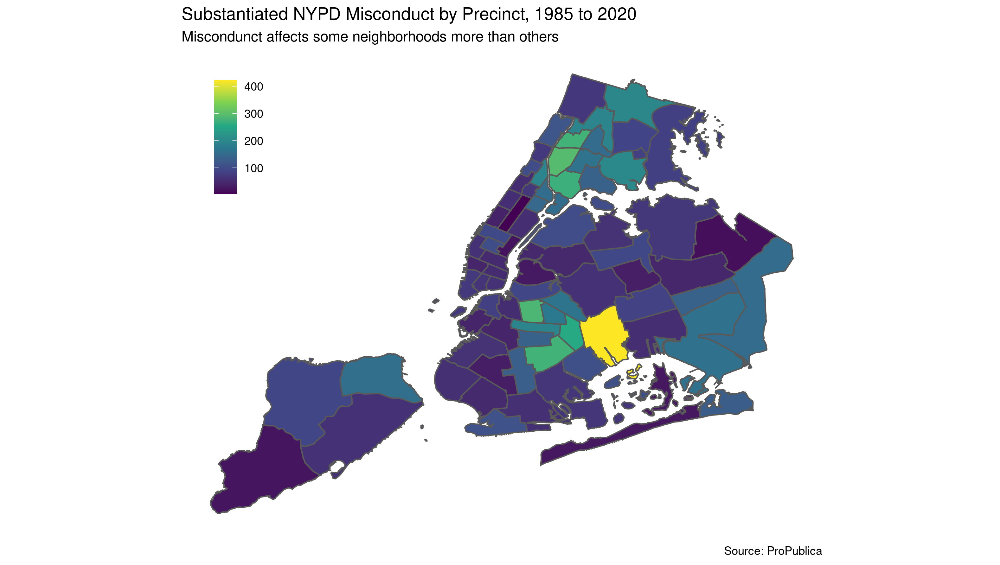
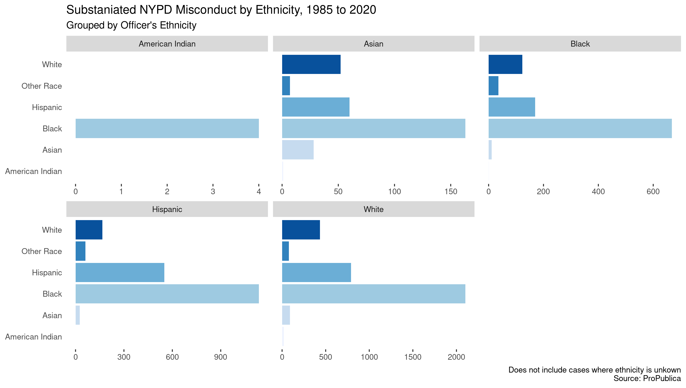
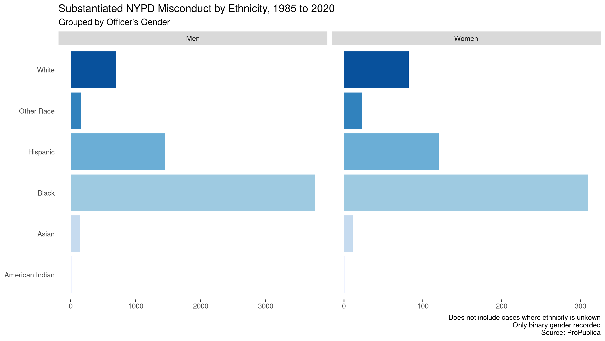

ProPublica recently released a partial database of New York Police Department (NYPD) disciplinary records. An analysis of substantiated complaints of police misconduct reveals clear systemic racism. Black people face wildly disproportionate amounts of police misconduct regardless of the race or gender of individual officers.  

Following a change to the New York law that kept police officers' disciplinary records secret---and amid an ongoing lawsuit---ProPublica has released a [searchable database](https://projects.propublica.org/nypd-ccrb/) of complaints to the Civilian Complaint Review Board (CCRB). The database, which can be downloaded in its entirety [here](https://www.propublica.org/datastore/dataset/civilian-complaints-against-new-york-city-police-officers), includes allegations against the nearly 4,000 officers who have at least one substantiated complaint against them. The CCRB's powers are extremely circumscribed, and these data reflect the board's [limitations](https://www.propublica.org/article/nypd-civilian-complaint-review-board-editors-note). The CCRB "exonerates" officers whose conduct is ruled to fall within departmental guidelines, no matter how egregious. Allegations may remain "unsubstantiated" due to a routine lack of NYPD cooperation (in violation of the law), and even "substantiated" allegations lead only to suggestions, which the department is free to ignore.

For the purpose of this analysis, despite these limitations, I am dealing only with substantiated complaints. Such complaints only represent a tiny slice of NYPD misconduct---in 2018 only 73 cases were substantiated out of about 3,000 allegations---but they still reveal striking patterns as to who this misconduct affects. Each complaint may contain multiple allegations, but I am treating each substantiated case of misconduct as a separate incident even though they may have happened at the same time.

Even a quick glance through these records turns up numerous officers who have committed repeated, serious, substantiated misconduct while rising through the ranks. But looking at these data from a bird's eye view also reveals some striking patterns in NYPD misconduct. Black people bear the brunt of NYPD misconduct, and in this matter, the race and gender of the individual officer in question does not seem to make any difference.

Anyone who is familiar with New York City would not expect police misconduct---and thus complaints about police misconduct---to be evenly distributed geographically, and that is the case here. 

The most substantiated complaints by far are found in the Seventy-Fifth Precinct in East New York, Brooklyn, the location of a major corruption scandal, but nearby neighborhoods in Brooklyn also see a disproportionate number of complaints, as does the South Bronx. This map seems to show the results of over-policing minoritized communities.

The ProPublica database records the ethnicity of both the complainant and the accused officer. 

In the majority of substantiated complaints the officers were white. In cases where the ethnicity of the complainant is known, the majority of complainants are Black. According to the Census Bureau's American Community Survey, New York City is 42.7% white, 29.1% Latino, 24.3% Black, and 13.9% Asian.

When we take a look at the ethnicity of these police officers, however, it does not seem to make much of a difference.

Officers of every ethnicity commit substantiated cases of misconduct against Black people at similar rates. White officers have a much greater overall number of cases, regardless of complainant's ethnicity. It's not clear from this data set whether this number is disproportionate to the number of white police in New York during this time period, but the disproportionate number of white officers is itself a symptom of systemic racism within the NYPD.

Similarly, officers' gender does not seem to make a difference when it comes to racist policing.

The same pattern of misconduct holds whether the officer in question is a man or a woman. Men commit many, many more acts of misconduct overall but whether this is out of proportion to their numbers on the force during this time period would require a different data set to determine.

The data analyzed here are limited and partial, but they corroborate what Black New Yorkers, other New Yorkers of color, and their white allies already know from experience: the NYPD is a profoundly racist institution, not because of a few bad apples, but on a structural level.

All code is available on [GitHub](https://github.com/jamesphare/website/tree/master/content/post/2020-07-28-systemic-racism-in-the-nypd/files/police.R).